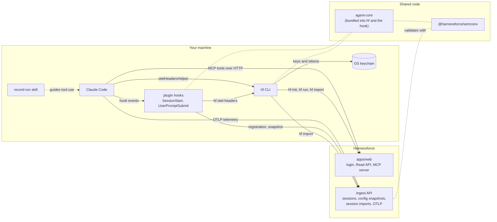

# harnessforce-agent

[](https://github.com/lambda-script/harnessforce-agent/actions/workflows/ci.yml)
[](LICENSE)
[](https://www.npmjs.com/package/@harnessforce/cli)
[](https://www.npmjs.com/package/@harnessforce/semconv)

The agent-side toolkit of Harnessforce: a Claude Code plugin, the `hf` CLI and the Harnessforce
semantic conventions.

Harnessforce links the work of coding agents to the Issues it was done for. This repository holds the
open source parts that run on your machine: they register each Claude Code session with its git
repository, branch and commit, point Claude Code's OpenTelemetry exporter at your Workspace, and give
the agent MCP tools to record plans, decisions and the Definition of Done. They send metadata, never
your prompts, responses or code.

## Packages

| Package | Description | Distribution |
| --- | --- | --- |
| [`@harnessforce/cli`](packages/cli) | `hf`: connects a machine to a Workspace, launches an agent for an Issue, imports past sessions | npm |
| [`@harnessforce/semconv`](packages/semconv) | `hf.*` attribute names and the JSON Schemas of the ingest API | npm |
| [`harnessforce` plugin](plugins/harnessforce) | Claude Code hooks, MCP server declaration, `record-run` and `propose-improvements` skills, `/harnessforce:setup` and `/harnessforce:tune` | Claude Code marketplace in this repository |
| `@harnessforce/agent-core` | Logic shared by `hf` and the plugin hook, bundled into both | private |
| `@harnessforce/test-support` | Test helpers | private |

## Quickstart

> Public distribution of the plugin and the CLI starts once the production domain of Harnessforce is
> decided. Until then, npm has no release and the plugin in this repository has no hooks; internal
> testers use the [local marketplace build](docs/runbooks/local-marketplace.md).

In Claude Code, with Node.js 18 or later installed:

```text
/plugin marketplace add lambda-script/harnessforce-agent
/plugin install harnessforce@harnessforce-agent
/harnessforce:setup
```

`/harnessforce:setup` installs the CLI (`npm install -g @harnessforce/cli`), runs `hf init` to log in
with the browser and pick a Workspace, and runs `hf import` for your past sessions. Restart Claude Code
and run `/harnessforce:setup` again to confirm that the first event arrived.

To work on an Issue, either let the agent use the `record-run` skill, or launch it through the CLI:

```sh
hf run --issue ENG-42 -- claude
```

To look back at your own past sessions, run `/harnessforce:tune`. It runs `hf tune` to count
interventions, loops and MCP server calls by public rules, and shows proposals (a diff or a pull
request draft) once there are at least 10 sessions. It never changes your files; you apply a proposal
yourself.

Organizations can instead distribute a Workspace ingest key through Claude Code managed settings; see
the [plugin README](plugins/harnessforce/README.md#session-registration-hooks).

## Privacy

- **Never sent:** prompts, responses, tool inputs and outputs, and file contents. `hf run` never turns
  on prompt or body logging, and `hf import` sends only session and first prompt IDs, start and end times, repository,
  branch, model, token counts and per-tool call and failure counts.
- **Hashes only:** the config snapshot describes CLAUDE.md files, rules, skills, agents, commands,
  settings and MCP servers by kind, scope, identifier and SHA-256 hash. Their contents, settings
  values and MCP server URLs, headers and environment are never sent.
- **Keys stay in the keychain:** `hf init` stores keys and tokens only in the OS keychain, never in a
  plain file, and `hf run` never puts them in the agent's environment, arguments or settings.
- **Keys go only where you connected:** the user key and the API token are sent only to the origins
  pinned by `hf init`, and the plugin reads a Workspace key only from the managed settings file, so a
  repository's `.claude/settings.json` cannot redirect them.
- **Fails quietly:** the hooks always exit 0 and give up after 2 seconds; a session is never blocked.

The per-package READMEs describe exactly what each command and hook sends.

## Architecture



- The **plugin hooks** register each session and its config snapshot with the ingest API, using the
  Workspace key from managed settings or the user key that `hf otel-headers` reads from the keychain.
- The **`hf` CLI** logs in with OAuth 2.0 and PKCE, supplies the ingest key to Claude Code's
  OpenTelemetry exporter through `otelHeadersHelper`, resolves Issues through the Read API, and imports
  past sessions.
- The **MCP server** is hosted by Harnessforce at `<connection URL>/mcp`; the plugin only declares it.
- **`@harnessforce/semconv`** defines what both sides send and accept.
- The connection URL is a single build input, `HARNESSFORCE_BUILD_URL`, shared by the CLI default and
  the MCP server URL.

## Development

Requirements: Node.js from [`.node-version`](.node-version) and pnpm (the version in `packageManager`,
for example through `corepack enable`).

```sh
pnpm install
HARNESSFORCE_BUILD_URL=http://localhost:3000 pnpm check
```

`pnpm check` runs lint (Biome), knip, typecheck, tests (Vitest) and build through Turborepo, as CI does.
The build needs `HARNESSFORCE_BUILD_URL`, the `apps/web` base URL baked into the CLI and the plugin, and
fails without it; `http://localhost:3000` is the value CI uses. CI also runs the tests on macOS,
Windows and Node.js 24, and runs the built CLI and hook on Node.js 18.

| Path | Contents |
| --- | --- |
| `packages/*` | Workspace packages (see [Packages](#packages)) |
| `plugins/harnessforce` | Plugin source and its build (`build.mjs`) |
| `.claude-plugin/marketplace.json` | The `harnessforce-agent` marketplace |
| `scripts/` | Release scripts |
| `tests/` | Repository-wide contract tests |
| `docs/runbooks/` | Operator procedures |

See [CONTRIBUTING.md](CONTRIBUTING.md) before opening a pull request.

## Release

`@harnessforce/cli` and `@harnessforce/semconv` are released with [Changesets](https://github.com/changesets/changesets)
and published to npm through trusted publishing with provenance. Publishing stays disabled until the
production domain is decided. See [Releasing](docs/runbooks/releasing.md).

## Links

- [Contributing](CONTRIBUTING.md)
- [Security policy](SECURITY.md)
- [Code of Conduct](CODE_OF_CONDUCT.md)
- [Building the local marketplace](docs/runbooks/local-marketplace.md)
- [Releasing](docs/runbooks/releasing.md)

## License

[Apache-2.0](LICENSE)
